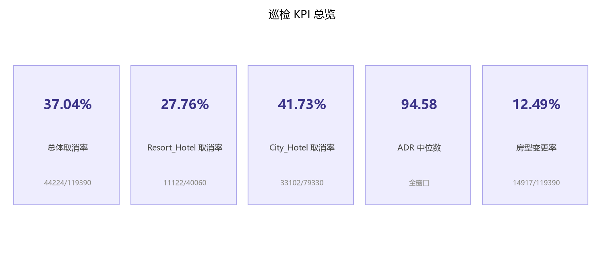
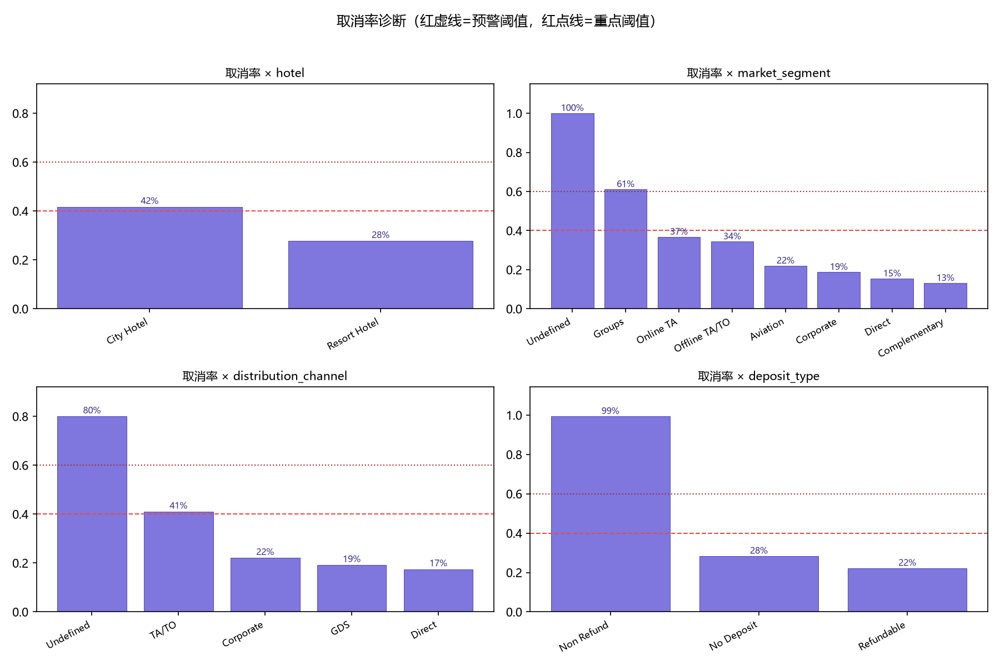
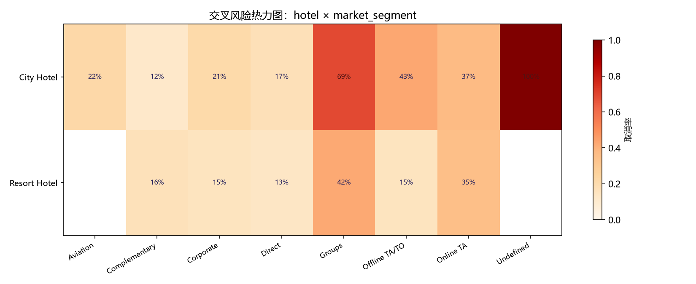
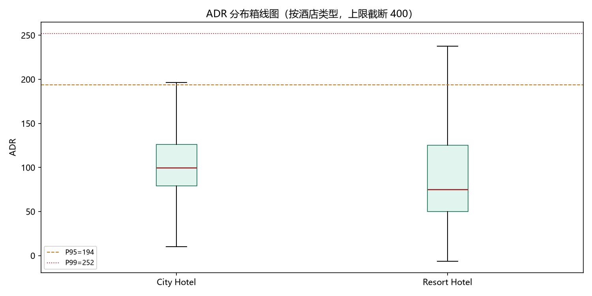
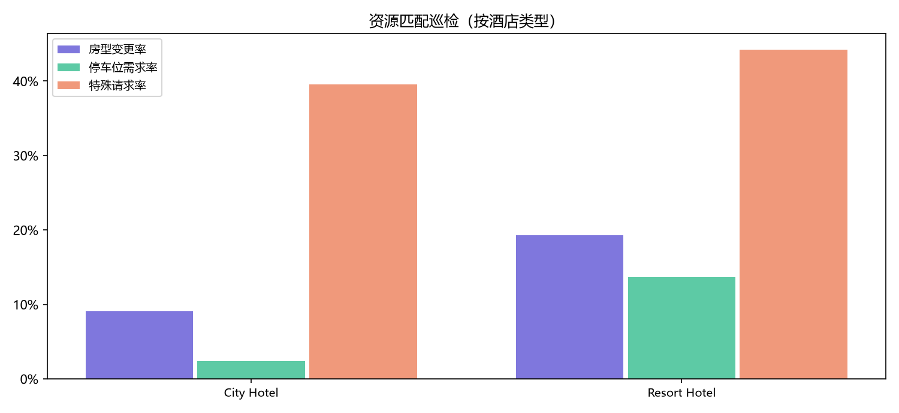

# 酒店预订取消率预警与收益巡检报告

> 生成时间：2026-08-26 21:17:52 · 工具：hotel-cancellation-revenue-watchdog · 报告语言：中文

## 1. 顶部 KPI

| 指标 | 数值 | 分子/分母 |
| --- | --- | --- |
| 总体取消率 | **37.04%** | 44224/119390 |
| City Hotel 取消率 | 41.73% | 33102/79330 |
| Resort Hotel 取消率 | 27.76% | 11122/40060 |
| ADR 中位数 | 94.58 | — |
| 房型变更率 | 12.49% | 14917/119390 |

## 2. 报告期间与数据范围

- 数据文件：`E:\10-workbuddy-skill\酒店预订取消率预警与收益巡检智能体\data\hotel_bookings.csv`（编码假设 utf-8-sig，119,390 行 × 32 列）
- 到店日期原始范围：2015-07-01 ~ 2017-08-31
- 分析窗口：2015-07-01 ~ 2017-08-31（end 含当天），窗口内 119,390 行，排除 0 行

## 3. 数据质量与清洗摘要

- 阻断问题 0 项；警告 1 项；降级分析 0 项（明细见 `quality/` 与 `summary.json`）
- 重复行：多余 31,994 行，重复组 40,165 行，处理策略 `report_only`（**未删除**，无可靠 booking_id）
- 清洗动作：children 缺失填 0；country 缺失填 Unknown；构造 has_agent/has_company；ADR 转数值并标记 `adr<=0` 与 `adr>P99`；文本去首尾空白。全部动作留痕于 `quality/cleaning_log.csv`
- **泄漏字段确认：`reservation_status` 已排除出预警输入字段**，仅用于数据质量一致性审计。

## 4. 取消率诊断

### 按 hotel

| 维度取值 | 总单量(分母) | 取消量(分子) | 取消率 | 样本量标记 | 风险标记 |
| --- | --- | --- | --- | --- | --- |
| City Hotel | 79,330 | 33,102 | 41.73% | 充足(>=100) | 风险信号 |
| Resort Hotel | 40,060 | 11,122 | 27.76% | 充足(>=100) | 正常 |

### 按 market_segment

| 维度取值 | 总单量(分母) | 取消量(分子) | 取消率 | 样本量标记 | 风险标记 |
| --- | --- | --- | --- | --- | --- |
| Undefined | 2 | 2 | 100.00% | 小样本(<30) | 仅展示 |
| Groups | 19,811 | 12,097 | 61.06% | 充足(>=100) | 重点风险 |
| Online TA | 56,477 | 20,739 | 36.72% | 充足(>=100) | 正常 |
| Offline TA/TO | 24,219 | 8,311 | 34.32% | 充足(>=100) | 正常 |
| Aviation | 237 | 52 | 21.94% | 充足(>=100) | 正常 |
| Corporate | 5,295 | 992 | 18.73% | 充足(>=100) | 正常 |
| Direct | 12,606 | 1,934 | 15.34% | 充足(>=100) | 正常 |
| Complementary | 743 | 97 | 13.06% | 充足(>=100) | 正常 |

### 按 distribution_channel

| 维度取值 | 总单量(分母) | 取消量(分子) | 取消率 | 样本量标记 | 风险标记 |
| --- | --- | --- | --- | --- | --- |
| Undefined | 5 | 4 | 80.00% | 小样本(<30) | 仅展示 |
| TA/TO | 97,870 | 40,152 | 41.03% | 充足(>=100) | 风险信号 |
| Corporate | 6,677 | 1,474 | 22.08% | 充足(>=100) | 正常 |
| GDS | 193 | 37 | 19.17% | 充足(>=100) | 正常 |
| Direct | 14,645 | 2,557 | 17.46% | 充足(>=100) | 正常 |

### 按 deposit_type

| 维度取值 | 总单量(分母) | 取消量(分子) | 取消率 | 样本量标记 | 风险标记 |
| --- | --- | --- | --- | --- | --- |
| Non Refund | 14,587 | 14,494 | 99.36% | 充足(>=100) | 重点风险【待人工审核】 |
| No Deposit | 104,641 | 29,694 | 28.38% | 充足(>=100) | 正常 |
| Refundable | 162 | 36 | 22.22% | 充足(>=100) | 正常 |

### 按 customer_type

| 维度取值 | 总单量(分母) | 取消量(分子) | 取消率 | 样本量标记 | 风险标记 |
| --- | --- | --- | --- | --- | --- |
| Transient | 89,613 | 36,514 | 40.75% | 充足(>=100) | 风险信号 |
| Contract | 4,076 | 1,262 | 30.96% | 充足(>=100) | 正常 |
| Transient-Party | 25,124 | 6,389 | 25.43% | 充足(>=100) | 正常 |
| Group | 577 | 59 | 10.23% | 充足(>=100) | 正常 |

完整各维度（含月份、国家）风险表见 `risk-tables/dimension_risk_table.csv`。排序依据：风险优先级 → 取消率 → ADR 中位数 → 订单量。

## 5. 交叉风险诊断

共完成 6 组交叉分析（`risk-tables/cross_analysis_results.csv`）。风险最高的组合：

| 分析组 | 组合 | 总单量 | 取消量 | 取消率 | 样本量标记 | 风险标记 |
| --- | --- | --- | --- | --- | --- | --- |
| hotel×market_segment | City Hotel × Groups | 13,975 | 9,623 | 68.86% | 充足(>=100) | 重点风险 |
| hotel×market_segment | City Hotel × Offline TA/TO | 16,747 | 7,173 | 42.83% | 充足(>=100) | 风险信号 |
| hotel×market_segment | Resort Hotel × Groups | 5,836 | 2,474 | 42.39% | 充足(>=100) | 风险信号 |
| deposit_type×customer_type | Non Refund × Contract | 544 | 544 | 100.00% | 充足(>=100) | 重点风险【待人工审核】 |
| deposit_type×customer_type | Non Refund × Transient | 12,909 | 12,909 | 100.00% | 充足(>=100) | 重点风险【待人工审核】 |
| deposit_type×customer_type | Non Refund × Transient-Party | 1,134 | 1,041 | 91.80% | 充足(>=100) | 重点风险【待人工审核】 |
| lead_time_bucket×is_canceled | 180+ | 24,692 | 14,077 | 57.01% | 充足(>=100) | 风险信号 |
| lead_time_bucket×is_canceled | 91-180 | 26,439 | 11,821 | 44.71% | 充足(>=100) | 风险信号 |
| total_of_special_requests×is_canceled | 0 | 70,318 | 33,556 | 47.72% | 充足(>=100) | 风险信号 |
| distribution_channel×deposit_type | TA/TO × Non Refund | 13,651 | 13,598 | 99.61% | 充足(>=100) | 重点风险【待人工审核】 |

解读提示：以上组合的取消率**与**该维度取值相关联（相关关系，非因果结论）；小样本组（<30）不下异常结论。

## 6. ADR 异常与收益巡检

- 全窗口 ADR 中位数 94.58；按维度的均值/中位数/P95/P99/adr<=0 数量/adr>P99 数量见 `risk-tables/adr_by_dimensions.csv`
- 异常清单（adr<=0 或 adr>P99）见 `detail-tables/adr_anomaly_list.csv`（首 5000 条）

## 7. 资源匹配巡检

- 房型变更率 12.49%（14,917/119,390）；预警阈值 15.00%
- 停车位需求率、特殊请求率按酒店×月份明细见 `detail-tables/room_resource_check.csv`

## 8. 深度诊断

- 趋势对比（按月取消率/ADR/房型变更/停车位/特殊请求）：`deep-diagnosis/trend_comparison.csv`
- 取消集中度（样本量≥100 过滤）：`deep-diagnosis/cancellation_concentration.csv`
- 风险放大器（高取消+高ADR、高取消+长提前期）：`deep-diagnosis/risk_amplifiers.csv`
- 措辞约定：仅描述「与……相关联/同时出现」，不声称因果。

## 9. 统计显著性分析

本节用统计检验判断「取消率与候选变量是否存在显著关系」，区别于第 4-5 节的描述性分组率。**显著（p<0.05）≠ 因果**，仅表明存在统计关联。

- 卡方检验 + Cramér's V：8 个分类变量，显著 8 个 → `statistics/chi2_results.csv`
- 相关系数（Pearson/Spearman）：15 个数值变量，显著 13 个 → `statistics/correlation_results.csv`
- 逻辑回归（is_canceled 为因变量）：21 个系数，显著 12 个 → `statistics/logistic_summary.csv`
- 变量重要性图：`statistics/variable_importance.png`

**分类变量关联强度 Top 5（按 Cramér's V 降序）**：

| 变量 | Cramér's V | p 值 | 显著性 | 关联强度 |
| --- | --- | --- | --- | --- |
| deposit_type | 0.4815 | 0.00e+00 | *** | 强 |
| lead_time | 0.3162 | 0.00e+00 | *** | 强 |
| market_segment | 0.2668 | 0.00e+00 | *** | 中 |
| assigned_room_type | 0.2030 | 0.00e+00 | *** | 中 |
| distribution_channel | 0.1771 | 0.00e+00 | *** | 中 |

**数值变量相关性 Top 5（按 |Pearson r| 降序）**：

| 变量 | Pearson r | Spearman ρ | p 值 | 显著性 | 方向 |
| --- | --- | --- | --- | --- | --- |
| lead_time | 0.2931 | 0.3166 | 0.00e+00 | *** | 正相关 |
| total_of_special_requests | -0.2347 | -0.2585 | 0.00e+00 | *** | 负相关 |
| required_car_parking_spaces | -0.1955 | -0.1974 | 0.00e+00 | *** | 负相关 |
| booking_changes | -0.1444 | -0.1851 | 0.00e+00 | *** | 负相关 |
| previous_cancellations | 0.1101 | 0.2702 | 8.93e-319 | *** | 正相关 |

**逻辑回归 OR 值 Top 5（按 |系数| 降序，仅显著项）**：

| 变量 | OR 值 | p 值 | 显著性 | 解释 |
| --- | --- | --- | --- | --- |
| deposit_type_Non Refund | 323.4456 | 0.00e+00 | *** | OR=323.45，每增1单位取消概率升高 |
| distribution_channel_Undefined | 15.7643 | 4.22e-02 | * | OR=15.76，每增1单位取消概率升高 |
| market_segment_Offline TA/TO | 0.4642 | 7.85e-06 | *** | OR=0.46，每增1单位取消概率降低 |
| customer_type_Transient | 1.7260 | 1.23e-34 | *** | OR=1.73，每增1单位取消概率升高 |
| customer_type_Group | 0.6043 | 9.52e-04 | *** | OR=0.60，每增1单位取消概率降低 |

**口径说明**：
- p 值：***p<0.001，**p<0.01，*p<0.05，ns 不显著
- Cramér's V 关联强度：<0.1 弱，0.1-0.3 中，0.3-0.5 强，>0.5 极强
- 逻辑回归 OR>1 表示取消概率升高，OR<1 表示降低
- 多重检验未做 Bonferroni 校正（巡检以发现为先，业务确认在后）

- 注意：普通 fit 失败（共线），改用 L1 正则化（无 p 值，仅参考系数方向与 OR）

## 10. 人工复核清单

1. **【待人工审核】无 booking_id 且重复行占比超过 20%**
   - 证据：重复组 40,165/119,390 行（33.64%），数据无唯一订单 ID
   - 建议：确认重复属于口径还是采集问题后再决定是否去重【待人工审核】
2. **【待人工审核】deposit_type×customer_type 组合「Non Refund × Contract」取消率 100.00%**
   - 证据：取消 544/544（充足(>=100)）；风险标记：重点风险【待人工审核】
   - 建议：疑似口径或业务定义问题，需人工确认【待人工审核】
3. **【待人工审核】deposit_type×customer_type 组合「Non Refund × Transient」取消率 100.00%**
   - 证据：取消 12909/12909（充足(>=100)）；风险标记：重点风险【待人工审核】
   - 建议：疑似口径或业务定义问题，需人工确认【待人工审核】
4. **【待人工审核】distribution_channel×deposit_type 组合「TA/TO × Non Refund」取消率 99.61%**
   - 证据：取消 13598/13651（充足(>=100)）；风险标记：重点风险【待人工审核】
   - 建议：疑似口径或业务定义问题，需人工确认【待人工审核】
5. **【待人工审核】distribution_channel×deposit_type 组合「Direct × Non Refund」取消率 97.49%**
   - 证据：取消 388/398（充足(>=100)）；风险标记：重点风险【待人工审核】
   - 建议：疑似口径或业务定义问题，需人工确认【待人工审核】
6. **【待人工审核】distribution_channel×deposit_type 组合「Corporate × Non Refund」取消率 94.42%**
   - 证据：取消 508/538（充足(>=100)）；风险标记：重点风险【待人工审核】
   - 建议：疑似口径或业务定义问题，需人工确认【待人工审核】
7. **【待人工审核】deposit_type×customer_type 组合「Non Refund × Transient-Party」取消率 91.80%**
   - 证据：取消 1041/1134（充足(>=100)）；风险标记：重点风险【待人工审核】
   - 建议：疑似口径或业务定义问题，需人工确认【待人工审核】
8. **【待人工审核】Non Refund 押金类型取消率 99.36%**
   - 证据：取消 14494/14587（充足(>=100)）
   - 建议：可能是业务定义或状态口径问题，不得直接下押金策略失败结论【待人工审核】
9. **【待人工审核】小样本组出现高取消率**
   - 证据：market_segment=Undefined（取消 2/2）；distribution_channel=Undefined（取消 4/5）；country=JEY（取消 8/8）；country=BEN（取消 3/3）；country=GGY（取消 3/3）；country=GLP（取消 2/2）；country=IMN（取消 2/2）；country=KHM（取消 2/2）
   - 建议：小样本不足以支撑结论，仅提示观察【待人工审核】

## 11. 局限性与降级分析说明

- - 无降级分析。
- 本报告为周期性巡检输出，非实时监控；所有业务动作建议均需人工确认后执行。
- 历史对比前提：字段口径未变化；若口径变化，将标注「口径变化待确认」并仅输出本期描述性分析。

## 12. 生成信息

- 数据文件：`E:\10-workbuddy-skill\酒店预订取消率预警与收益巡检智能体\data\hotel_bookings.csv`
- 窗口：2015-07-01 ~ 2017-08-31
- 生效阈值：{"min_sample_size": 30, "min_sample_for_risk": 100, "cancellation_rate_alert": 0.4, "cancellation_rate_critical": 0.6, "non_refund_cancel_alert": 0.9, "room_change_rate_alert": 0.15, "adr_extreme_percentile": 99}
- 阈值覆盖记录：0 条（`summary.json`）
- 生成时间：2026-08-26 21:17:52
